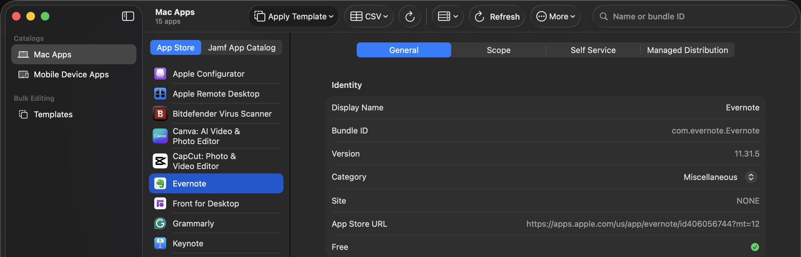
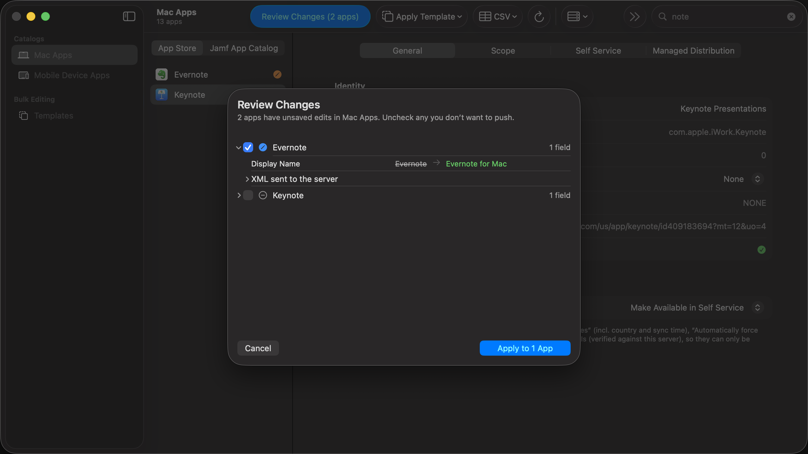
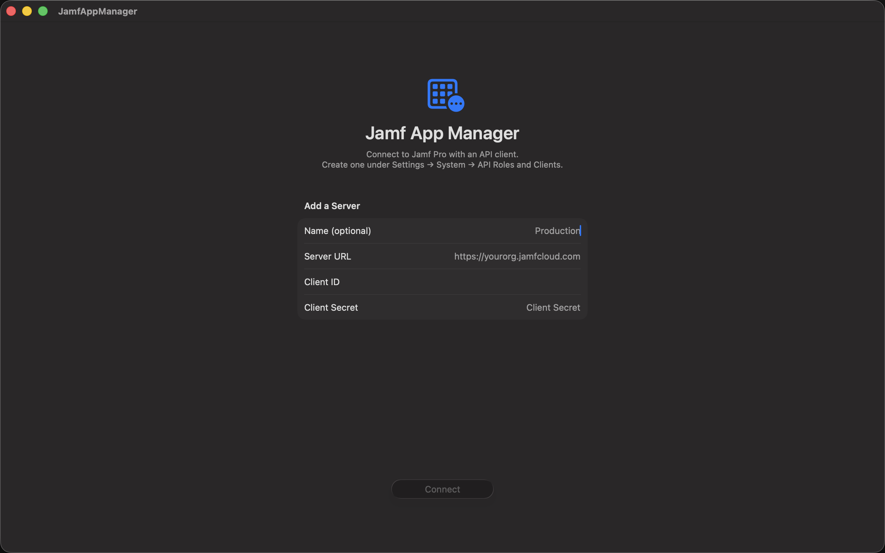

# Jamf App Manager

A macOS 26 (SwiftUI, Liquid Glass) app for viewing and mass-modifying app settings in Jamf Pro — both **Mobile Device Apps** (Devices section) and **Mac Apps** (Computers section). Inspired by The MUT, but focused on per-app editing plus reusable setting **templates** that can be applied to many apps at once, covering the General, Scope, Managed Distribution, and App Configuration tabs.



Every write — a single field, a template applied to fifty apps, or a CSV import — is staged as an old → new diff and sent only after explicit confirmation. Edits pile up across apps as you work; Review Changes gathers everything pending in the catalog into one push, with a checkbox per app so you can hold some back for later. Only changed fields are transmitted, so untouched settings can never be clobbered:



## CSV format

Header row, one row per app. Identifier columns: `id`, `bundle_id`, or `name` (at least one). Setting columns use field names (`displayName`, `deployAsManagedApp`, `scopeGroups`, `category`, `vppLocation`, `ssButtonText`, …) or their UI labels. Empty cells leave that field untouched. Scope lists are semicolon-separated names or `#id`s ("All iPads; #22"). `category` takes a category name, `#id`, or `None` to clear. `ssCategories` takes semicolon-separated category names with a trailing `*` to feature ("Applications; Maintenance*"). Booleans accept true/false, yes/no, 1/0. The easiest way to get a valid file is Export All to CSV, edit, re-import.

Note: the Jamf web UI shows a few Mac App Store fields (Enabled, App Store auto-sync schedule, forced updates) that have no Classic API representation — they can't be edited by any external tool.

## Development

Requires Xcode 26 on macOS 26. The `.xcodeproj` is generated and not committed — after cloning:

```sh
brew install xcodegen
xcodegen generate
xcodebuild -project JamfAppManager.xcodeproj -scheme JamfAppManager build
```

Edit `project.yml` (not the xcodeproj) and re-run `xcodegen generate` when the project structure changes.

## Jamf Pro setup

Create an API role and client under **Settings → System → API Roles and Clients**. The exact privileges (named as they appear in Jamf's privilege picker):

| To browse (read-only) | To save changes |
| --- | --- |
| Read Mac Applications | Update Mac Applications |
| Read Mobile Device Applications | Update Mobile Device Applications |
| Read Smart Computer Groups, Read Static Computer Groups | |
| Read Smart Mobile Device Groups, Read Static Mobile Device Groups | |
| Read Buildings, Read Departments, Read Categories | |
| Read Volume Purchasing Locations | |

Jamf App Catalog (App Installers) deployments have no privilege of their own — their endpoints are governed by the Mac Applications privileges. Start read-only if you want to evaluate safely — the app works fully as a browser, and every write is gated behind a diff preview and explicit confirmation regardless.

API notes: full app records (scope, VPP, self service, app configuration) come from the Classic API (`/JSSResource/mobiledeviceapplications`, `/JSSResource/macapplications`) — JSON for reads, field-masked XML for writes. Jamf App Catalog deployments use the Pro API (`/api/v1/app-installers`). OAuth tokens come from `/api/oauth/token`.



## Status

- ✅ Connect screen: multiple saved servers, API Roles & Clients (OAuth client credentials), secrets in the login Keychain, URL prefilled from this Mac's Jamf enrollment
- ✅ Browse Mac Apps (App Store + Jamf App Catalog tabs) and Mobile Device Apps with search
- ✅ Editing: General / Managed Distribution / App Configuration fields with change tracking; every write gated behind an old→new diff review (field-masked partial XML PUT)
- ✅ Templates: field-masked setting sets (create by hand or "Save Settings as Template" from any app), multi-select apps → dry-run per-app diff → confirmed batch apply with live results
- ✅ Scope editing: all-targets toggle, group/building/department pickers, exclusions — per app and in templates (lists are full replacements, compared order-insensitively)
- ✅ Self Service tab (button text, description, notifications, categories with display/feature), category picker, VPP location picker
- ✅ Jamf App Catalog deployment editing (Pro API JSON PUT, same review gate)
- ✅ CSV import/export (MUT-style): export current settings, edit in a spreadsheet, re-import — every row dry-run diffed before the one confirmation

## License

Copyright 2026 Vantine Imaging LLC.

Licensed under the [Apache License, Version 2.0](LICENSE). You may use, modify
and redistribute this, including commercially, provided you keep the copyright
and license notices and state any changes you make. It is provided without
warranty of any kind. See [NOTICE](NOTICE) for the attribution notice that
accompanies redistribution.

JamfAppManager was written at Vantine Imaging LLC and is owned by it; it is
published here because bulk-editing app settings is a problem every Jamf admin
has, and The MUT's spiritual successor deserved to exist.

### Contributing

Issues and pull requests are welcome. Contributions are accepted under the
terms of the Apache License 2.0 — per section 5 of the licence, anything you
deliberately submit for inclusion is licensed under it without additional
terms.
